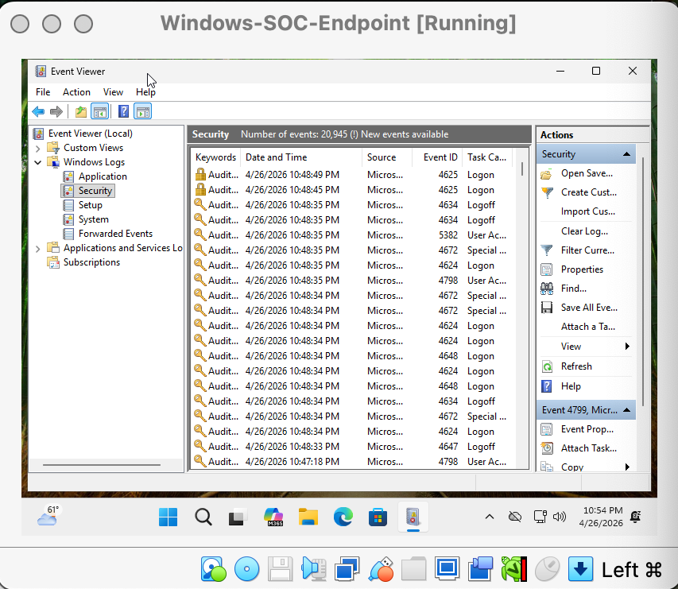
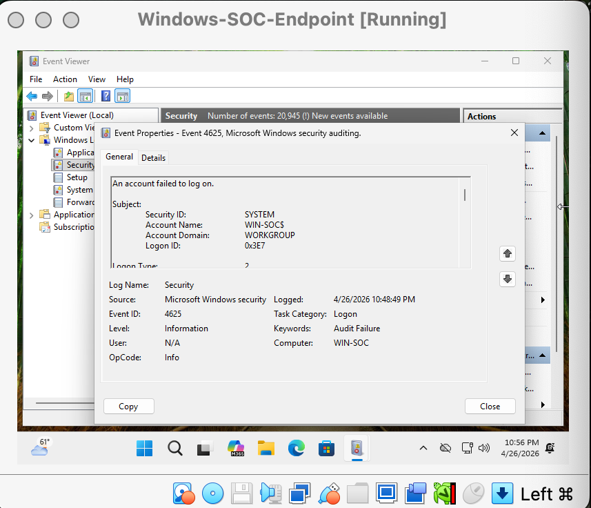

# Failed Login Detection - Windows Event ID 4625

## Overview
This case report documents failed Windows login activity generated in a SOC home lab. The goal was to create failed authentication events, identify them in Windows Event Viewer, and document the evidence as part of a basic SOC analyst investigation.

## Lab Environment
- Windows 11 ARM virtual machine
- Local Windows account: socanalyst
- Windows Event Viewer
- Windows Security logs

## Detection Objective
Identify failed login attempts using Windows Security Event ID 4625.

## Steps Performed
1. Set up a Windows 11 virtual machine as a lab endpoint.
2. Opened Windows Event Viewer.
3. Navigated to Windows Logs → Security.
4. Generated failed login attempts by entering an incorrect password multiple times.
5. Located Event ID 4625 in the Security log.
6. Reviewed the event details to confirm the failed logon activity.

## Evidence
### Windows Security Log

### Failed Login Event ID 4625

## Key Event Information
- Event ID: 4625
- Log Name: Security
- Source: Microsoft Windows security auditing
- Task Category: Logon
- Keywords: Audit Failure
- Computer: WIN-SOC

## Analyst Notes
Event ID 4625 indicates that an account failed to log on. Multiple failed login events in a short period could indicate a brute-force attempt, password guessing, or a user repeatedly entering the wrong password.

## Conclusion
This lab demonstrated how failed Windows login attempts appear in the Security log and how a SOC analyst can identify authentication failures using Event Viewer. This detection is a basic but important starting point for investigating suspicious login behavior.
